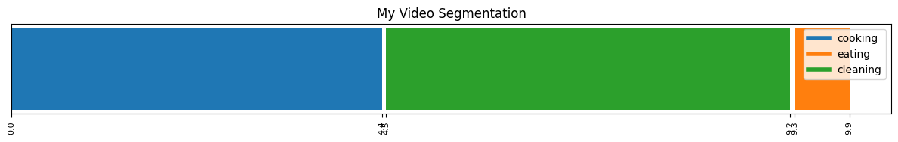

# 🎬 TAS-Helpers

A lightweight Python package providing essential utilities for **Temporal Action Segmentation** (TAS). Whether you're visualizing segmentations, converting annotations, or evaluating model performance, TAS-Helpers has you covered.

## 📦 Installation

```bash
pip install git+https://github.com/raideno/tas-helpers.git
```

## 🚀 Quick Start

```python
from tas_helpers.visualization import SegmentationVisualizer
from tas_helpers.utils import generate_random_segmentation

# NOTE: create sample data
labels = ["cooking", "eating", "cleaning"]
segmentation = generate_random_segmentation(length=200, labels=labels)

# NOTE: visualize it
visualizer = SegmentationVisualizer(labels_values=labels)
visualizer.plot_segmentation(segmentation, fps=20, header="My Video Segmentation")
```



## 📊 Features

### 🎨 Visualization

**`SegmentationVisualizer`** - Create beautiful timeline visualizations of your temporal action segmentations.

```python
from tas_helpers.visualization import SegmentationVisualizer

visualizer = SegmentationVisualizer(
    labels_values=["action1", "action2", "action3"],
    labels_names=["Cooking", "Eating", "Cleaning"],  # Optional display names
    labels_colors=["red", "blue", "green"]           # Optional custom colors
)

# Plot frame-level annotations
visualizer.plot_segmentation(
    frames_labels=your_segmentation,
    fps=30,
    header="Video Segmentation Results",
    show_legend=True
)
```

### 🔧 Utilities

**Data Generation & Conversion**

```python
from tas_helpers.utils import (
    generate_random_segmentation,
    frame_level_annotations_to_segment_level_annotations,
    segment_level_annotations_to_frame_level_annotations
)

# Generate test data
random_seg = generate_random_segmentation(
    length=1000,
    labels=["walk", "run", "jump"],
    min_segment_length=25,
    max_segment_length=100
)

# Convert between formats
segments = frame_level_annotations_to_segment_level_annotations(
    annotations=random_seg,
    fps=30
)
# Returns: [("walk", start_ms, end_ms), ("run", start_ms, end_ms), ...]
```

### 📈 Evaluation Metrics

**Standard TAS Metrics**

```python
from tas_helpers.metrics import edit_score, mof_score, f1_score

# Edit Distance (Levenshtein-based)
edit_dist = edit_score(y_true, y_pred)

# Mean Over Frames (MOF) - frame-wise accuracy
mof = mof_score(y_true, y_pred)

# F1 Score with overlap threshold
f1 = f1_score(pred_segments, gt_segments, overlap_threshold=25)
```

**Quality Assessment Scores**

```python
from tas_helpers.scores import order_variation_score, repetition_score

# Measure consistency of action ordering across videos
order_consistency = order_variation_score([
    ["cook", "eat", "clean"],
    ["cook", "clean", "eat"],
    ["eat", "cook", "clean"]
])

# Measure action repetition within a video
repetition = repetition_score(["cook", "eat", "cook", "clean", "cook"])
```

## 📖 API Reference

### Metrics

| Function                                | Description                                | Range  |
| --------------------------------------- | ------------------------------------------ | ------ |
| `edit_score(y_true, y_pred)`            | Normalized edit distance between sequences | [0, 1] |
| `mof_score(y_true, y_pred)`             | Frame-wise accuracy                        | [0, 1] |
| `f1_score(pred_seg, gt_seg, threshold)` | F1 score with temporal overlap             | [0, 1] |

### Scores

| Function                        | Description                               | Range  |
| ------------------------------- | ----------------------------------------- | ------ |
| `order_variation_score(videos)` | Action ordering consistency across videos | [0, 1] |
| `repetition_score(sequence)`    | Action repetition within sequence         | [0, 1] |

### Utilities

| Function                                                 | Description                      |
| -------------------------------------------------------- | -------------------------------- |
| `generate_random_segmentation()`                         | Create test segmentation data    |
| `frame_level_annotations_to_segment_level_annotations()` | Convert frame labels to segments |
| `segment_level_annotations_to_frame_level_annotations()` | Convert segments to frame labels |

## 📚 References

Some metrics are based on:

- [Temporal Action Segmentation: An Analysis of Modern Techniques](https://arxiv.org/pdf/2210.10352) (arXiv:2210.10352)
